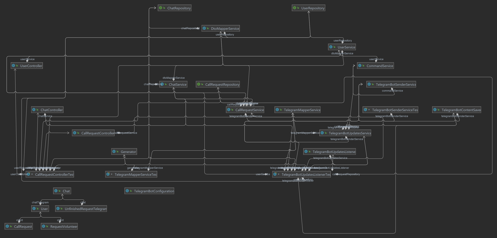

# AnimalShelter-MH-4

## [1.1] The main description.

This project implements the use of bot telegrams
for the needs of the Shelter. 
The fundamental idea is that due to the fact that 
the Telegram service itself is widespread everywhere.
This allows any user to conveniently and quickly
find out information about the animal shelter and how 
to take a pet. Also, be able to quickly and easily 
contact a volunteer working at the shelter and 
qualitatively monitor the conditions in which the 
animals that the users have taken live.

## [1.2] The content of the project and its purpose.
The main goal of the project is to
simplify the work of volunteers as much as possible, to help
potential clients
find a pet and shelter as easily and quickly as possible. Using at
the same time an accessible and very popular application.

This project at the moment of development, the project
contains these classes in working order.

1. service 
   1. [CallRequestService](./documentation/CallRequestService.md)
   2. [ChatService](./documentation/ChatService.md)
   3. [CommandService](./documentation/CommandService.md)
   4. [DtoMapperService](./documentation/DtoMapperService.md)
   5. [TelegramBotContentSaver](./documentation/TelegramBotContentSaver.md)
   6. [TelegramBotSenderService](./documentation/TelegramBotSenderService.md)
   7. [TelegramBotUpdatesService](./documentation/TelegramBotUpdatesService)
   8. [TelegramMapperService](./documentation/TelegramMapperService.md)
   9. [UserService](./documentation/UserService.md)
2. repository
   1. CallRequestRepository
   2. ChatRepository
   3. RequestVolunteerRepository
   4. UnfinishedRequestRepository
   5. UserRepository
3. listener
   1. [TelegramBotUpdatesListener](./documentation/Listener.md)
4. model
   1. Command 
5. info
   1. InfoAboutShelter
   2. InfoTakeADog
6. exception
   1. CallRequestNotFoundException
   2. ChatNotFoundException
   3. UserNotFoundException
7. entityDto
   1. CallRequestDto
   2. ChatDto
   3. UserDto
8. entity
   1. CallRequest
   2. Chat
   3. RequestVolunteer
   4. UnfinishedRequestTelegram
   5. User
9. controller
   1. [CallRequestController]
   2. [ChatController]
   3. [UserController]
10. configuration
    1. [TelegramBotConfiguration](./documentation/Configuration.md) 
11. AnimalShelter4Application
    

## [1.2.1] The principle of the project.

The basic principle of the project w.e can see
on. 

## [2.1] Listener
### [TelegramBotUpdatesListener]

 

* The class implementing the UpdateListener interface of the Pengrad library
* Class engaged in communicating with Telegram services
* and sending the received list of {@link Update} objects
* to the {@link TelegramBotUpdatesService#processUpdate(Update)} class for processing.
* At the end of the method {@link TelegramBotUpdatesListener#process(List)}, objects are marked as processed, despite possible errors.
  
